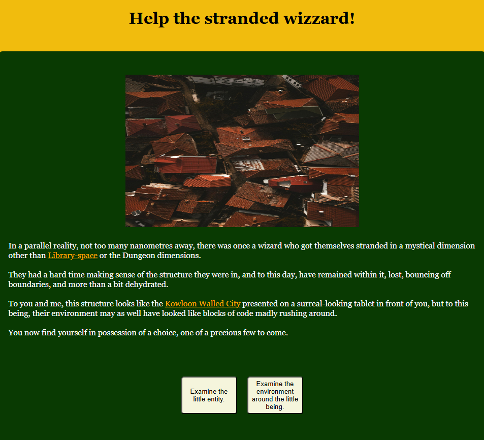

<h1>Choose your own adventure: Help the stranded wizzard!</h1>

<h3>A Wizzard - minus the qualifying aspects of a magical educational degree as a normal, dignified Wizard - has found themselves lost in a strange alternative dimension. How would you choose to aid them?</h3>

The Choose Your Own Adventure genre has its origins in interactive storytelling and fiction, with earliest documented references dating back to the "Book of Changes, the ancient Chinese manual of divination and prophecy that employs cleromancy", according to Jackie Mansky's 2022 article in the <a href="https://www.smithsonianmag.com/innovation/surprisingly-long-history-of-choose-your-own-adventure-stories-180980014/">Smithsonian magazine</a>. Its 20th century popularity's rooted in the 1930 interactive novel named <em>Consider the Consequences!</em> and Luis Borges’ 1941 short story “El jardín de senderos que se bifurcan” (“The Garden of Forking Paths”). A more recent popular resurgence came from the 1979 Choose Your Own Adventure book series which brought the genre of interactive fiction to a wider audience, panned though it was for its literary quality.

The current game offers click-based, straightforward narrative forks and four endings, currently without an inventory system and other enhancements, with two endings reaching a winning condition each and the other two reaching a losing condition each. It uses as its narrative frame the character of Rincewind, a character present in several novels of Terry Pratchett's 1983 to 2015, 41-novel Discworld series, a satire of fantasy and science-fiction tropes prevalent in media immediately post World War II.

<h3>Play the game here:</h3> 

<h3>Images obtained from:</h3>
https://images.pexels.com
https://giphy.com/
https://pixabay.com/
https://www.artstation.com/

<h3>Technologies used:</h3> Javascript, HTML, CSS

<h3>Stretch goals:</h3> Inventory, increased user interactivity
